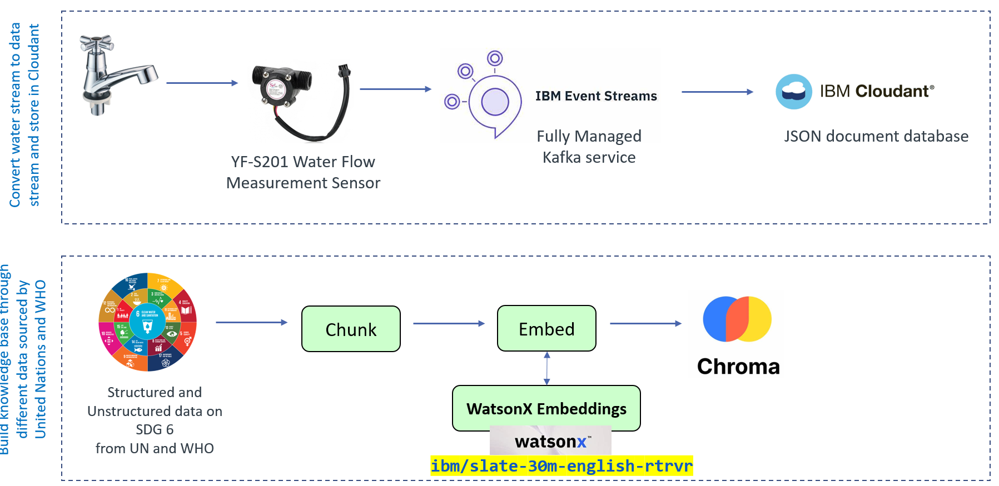
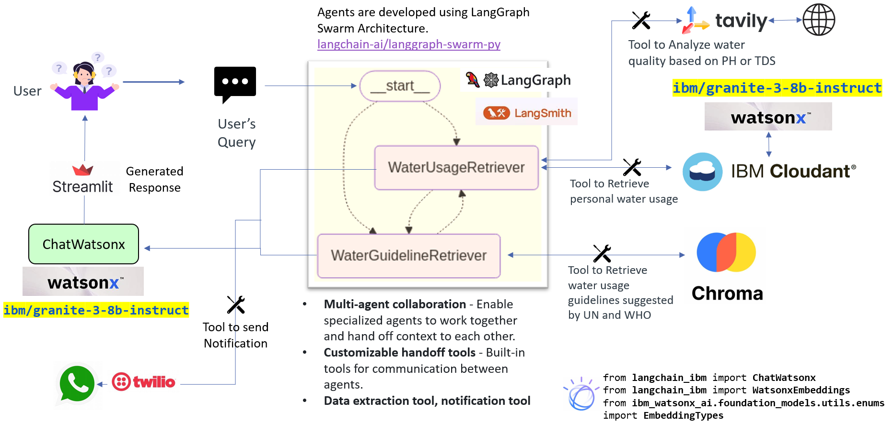

## System Overview

Our AI-driven solution is a **low-cost, plug-and-play water usage tracker and intelligent advisory system** that enables households to:
- Monitor real-time water consumption via a sensor attached to **water taps**.
- Detect leaks and anomalies to reduce wastage.
- Analyze water quality based on pH and TDS values.
- Receive personalized recommendations on sustainable water practices.
- Access globally recognized water guidelines from the UN and WHO.
- Receive multilingual AI-generated insights and alerts for accessibility.

It leverages:
- **IBM Cloudant** for schema-less NoSQL storage
- **IBM Event Stream** for real-time streaming of water consumption data into Cloudant
- **ChromaDB** for high-dimensional vector embeddings
- **IBM WatsonX** (LLMs) for natural language question-answering
- **Streamlit** for interactive UI

---

## Visual representation data ingestion



## High-Level Architecture Diagram of Agentic AI



---

## Component-Wise Breakdown

### Sensor Layer
- **rpi_connector.py**: Collects raw water quality metrics from Raspberry Pi interfacing with the sensor.
- Directly reads from **hardware GPIO/UART**.

---

### Data Ingestion Layer
- **IBM Event Stream** is used as the real-time streaming backbone, via Kafka.
  - `kafka_producer.py`: Publishes real-time data into Kafka topics.
  - `kafka_consumer.py`: Subscribes to the topic and processes the streaming data.

---

### Data Persistence Layer

#### NoSQL Storage
- **IBM Cloudant**:
  - A scalable, distributed, document-oriented database service.
  - Used to store ingested water data as JSON documents.
  - Scripts:
    - `load_cloudant_in_json.py`: Upload JSON to Cloudant.
    - `read_cloudant.py`: Retrieve and read from Cloudant.
    - `cloudant_search.py`: Query using Cloudant’s built-in Mango query language.

#### Local Caching
- **SQLite DB**:
  - `json_to_sqlite.py`: Converts JSON documents from Cloudant into SQLite for faster local querying and backup for this MVP.

---

### Vector Database Layer

- **ChromaDB** (Open-source vector store):
  - Converts unstructured water/environmental data into dense vector embeddings.
  - `load_vector_un.py`: Vectorizes and stores using SentenceTransformers/Text2Vec.
  - `read_vector.py`: Validates vector retrieval and relevance.

---

### User Interface Layer

- **Streamlit Web App**:
  - `system_chat.py` is the entry point.
  - Enables users to:
    - Ask natural language questions (e.g., "Is the water quality below threshold?")
    - View intelligent answers with explanations.
    - Visualize results (can be extended with charts or tables).

---

## Technologies Used

| Tech | Description |
|------|-------------|
| **IBM Cloudant** | Managed NoSQL database for JSON documents. |
| **Apache Kafka** | Distributed messaging for real-time streaming. |
| **SQLite** | Lightweight SQL database for local analysis. |
| **ChromaDB** | Vector DB for storing and retrieving document embeddings. |
| **WatsonX LLMs** | IBM's foundation models for natural language understanding. |
| **Streamlit** | Lightweight UI for interacting with agents. |
| **LangChain** | Agent chaining, memory, and prompt templates. |
| **Python** | Core programming language for scripting and orchestration. |

## Folder Structure

| Folder/File | Description |
|-------------|-------------|
| `kafka_producer.py` | Sends sensor data to IBM Event Stream. |
| `kafka_consumer.py` | Receives Kafka messages and insert that in Cloudant DB. |
| `load_cloudant_in_json.py` | Pushes JSON data into Cloudant. |
| `read_cloudant.py` | Reads from Cloudant DB. |
| `cloudant_search.py` | Runs Cloudant queries. |
| `json_to_sqlite.py` | Converts Cloudant JSON to SQLite. |
| `swarm_agents.py` | Multiple agents collaborating to answer queries. |
| `load_vector_un.py` | Load document data into Chroma vector DB. |
| `read_vector.py` | Retrieve and validate vector embeddings. |
| `system_prompt.py` | Prompt templates for AI agents. |
| `system_chat.py` | Chatbot interface using Streamlit. |

---

## Setup Instructions

### 1. Clone the Repo

```bash
git clone <repo-url>
cd ibm_hackathon
```

### 2. Setup Environment Variables

Create a `.env` file and add:

```env
CLOUDANT_APIKEY=
CLOUDANT_URL=
DATABASE_NAME=

WATSONX_APIKEY=
WATSONX_PROJECTKEY=

TWILIO_SID=
TWILIO_AUTH_TOKEN=
TWILIO_WHATSAPP_NUMBER=
MY_WHATSAPP_NUMBER=

LANGCHAIN_API_KEY=

KAFKA_BOOTSTRAP_SERVER=
KAFKA_SSL_PASSWORD=

TAVILY_API_KEY=
```

### 3. Install Dependencies

```bash
pip install -r requirements.txt
```

---

##  Run the Project

### Step 1: Load Data to Cloudant

```bash
python load_cloudant_in_json.py
```

### Step 2: Convert to SQLite

```bash
python json_to_sqlite.py
```

### Step 3: Populate Vector DB

```bash
python load_vector_un.py
```

### Step 4: Validate Vector Storage (Optional)

```bash
python read_vector.py
```

### Step 5: Run the Agent Chat UI

```bash
streamlit run system_chat.py
```
---
